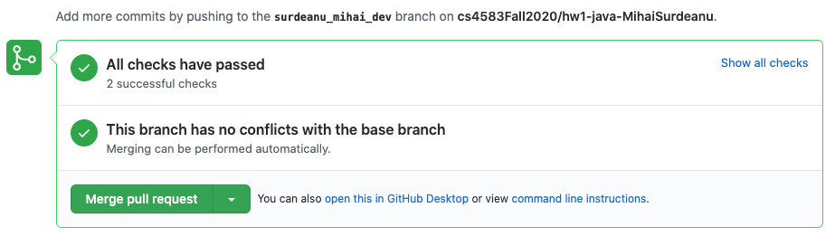
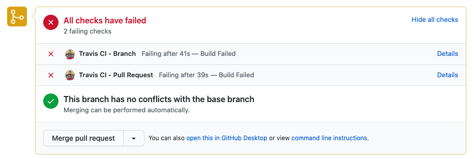

# Setup your environment

You will need to set up an appropriate coding environment on whatever computer
you expect to use for this assignment.
Minimally, you should install:

* [git](https://git-scm.com/downloads)
* [Java](https://www.java.com/en/)(8 or higher)
* [Maven](https://maven.apache.org/)

# Check out a new branch

Before you start editing any code, you will need to create a new branch in your
GitHub repository to hold your work.

1. Go to the repository that GitHub Classroom created for you. You should have received an email/link and you are most probably reading this there. It should look like
`https://github.com/cs4583_fall2020_hw*_java/cs-<your-username>`, where
`<your-username>` is your GitHub username. 
[Create a branch through the GitHub interface](https://help.github.com/articles/creating-and-deleting-branches-within-your-repository/).
2. Name your `<branch>` as `lastname_firstname_dev`
2. Clone the repository to your local machine and checkout the branch you
just created. Your command must be similar to :
   ```
   git clone -b <branch> https://github.com/cs4583_fall2020_hw*_java/cs-<your-username>.git
   git checkout lastname_firstname_dev
   ```

# Write your code

You will implement one function each for each of the programming sub qns, Eg:`runQ1_1()` inside 
the class `QueryEngine`. These functions should return the documents as asked in the question as a List of `ResultClass`. 

Also, you **should not edit** these files:
- `.travis.yml`
- `src/main/resources/*.txt`
- `src/test/java/edu/arizona/cs/*.java`
- `src/main/java/edu/arizona/cs/ResultClass.java`


# Test your code

Tests have been provided for you in the `src/test/java/edu/arizona/cs/Test_*.java` file.
To run all the provided tests, run the ``mvn test`` script from the top project directory which contains a file named `pom.xml`

If your code passes the test case, you will see an output similar to:
```
[INFO] -------------------------------------------------------
[INFO]  T E S T S
[INFO] -------------------------------------------------------
[INFO] Running edu.arizona.cs.TestQ5
[INFO] Tests run: 3, Failures: 0, Errors: 0, Skipped: 0, Time elapsed: 0.038 s - in edu.arizona.cs.TestQ5
[INFO] 
[INFO] Results:
[INFO] 
[INFO] Tests run: 3, Failures: 0, Errors: 0, Skipped: 0
[INFO] 
[INFO] ------------------------------------------------------------------------
[INFO] BUILD SUCCESS
[INFO] ------------------------------------------------------------------------
[INFO] Total time:  4.037 s
[INFO] Finished at: 2020-08-23T15:06:13-07:00
[INFO] ------------------------------------------------------------------------

```


Note: doing `mvn clean` from time to time is a good habit

# Submit your code

As you are working on the code, you should regularly `git commit` to save your
current changes locally and `git push` to push all saved changes to the remote
repository on GitHub.

To submit your assignment,
[create a pull request on GitHub](https://help.github.com/articles/creating-a-pull-request/#creating-the-pull-request).
where the "base" branch is "main", and the "compare" branch is the branch you
created at the beginning of this assignment.
Then go to the "Files changed" tab, and make sure that all your changes look as you would expect them
to.
There are test cases that will be run automatically (via., [travis](https://travis-ci.com/))
when a pull request is submitted. 
These are the same as `mvn test`. 
So if your code passed `mvn test` in your machine, 
it’s highly likely that it will pass in github. Nevertheless 
you should make sure that you see a green tick mark or a message 
saying “All Checks Have Passed”,


If your test cases are failing, you will get an error message like this.


click on the link which says `details` and find out what is causing the issue or which test case is not passing. Once you have identified that, close the pull request, fix the errors, and raise another pull request.
**Do not merge the pull request.**

Also note that if you change your code after raising a pull request, the changes will be automatically reflected in the pull request and hence in your travis test cases passing or not. 

Your instructor will grade the code off this pull request. 
Pull requests submitted after the deadline won’t be considered.
If you have raised a pull request, then you don't have to submit the code in D2l.
However do note that you still have to submit the answers to the other written questions in D2l. 
# Grading


The programming question of this assignment will be graded primarily on their ability to pass the tests that
have been provided to you on github after the pull request.
Assignments that pass all, and with the corresponding code implementing the correct logic, will receive at least 95% of the
possible points.

To get the remaining of the points, your code will be checked for things like readability and code quality.
***Please note that this time on there will be a penalty for not following all instructions. Especially `do not merge the pull request`.***
